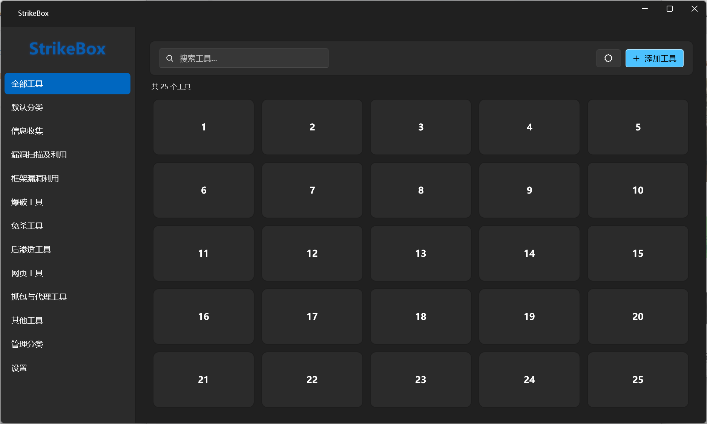
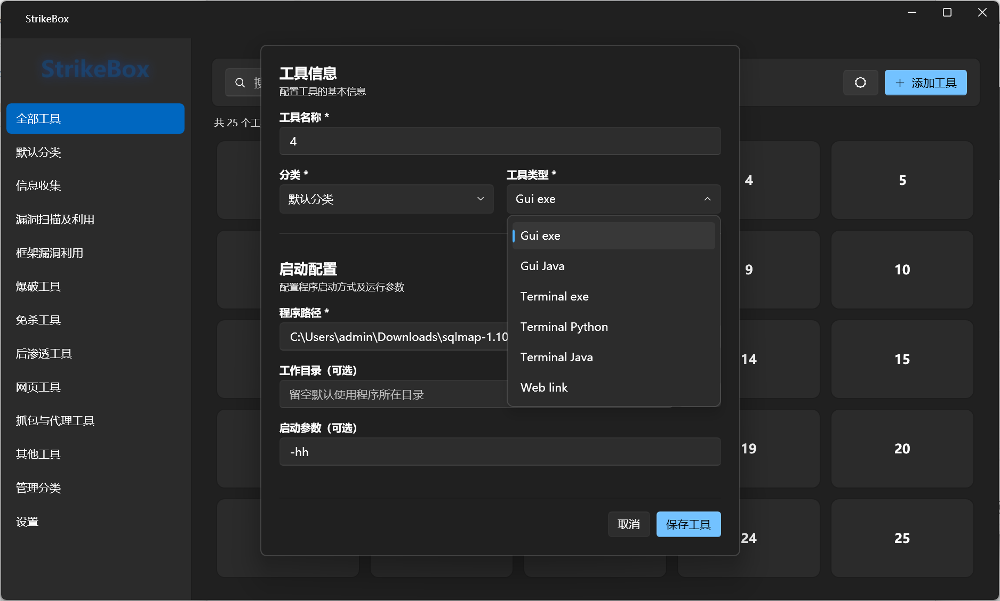
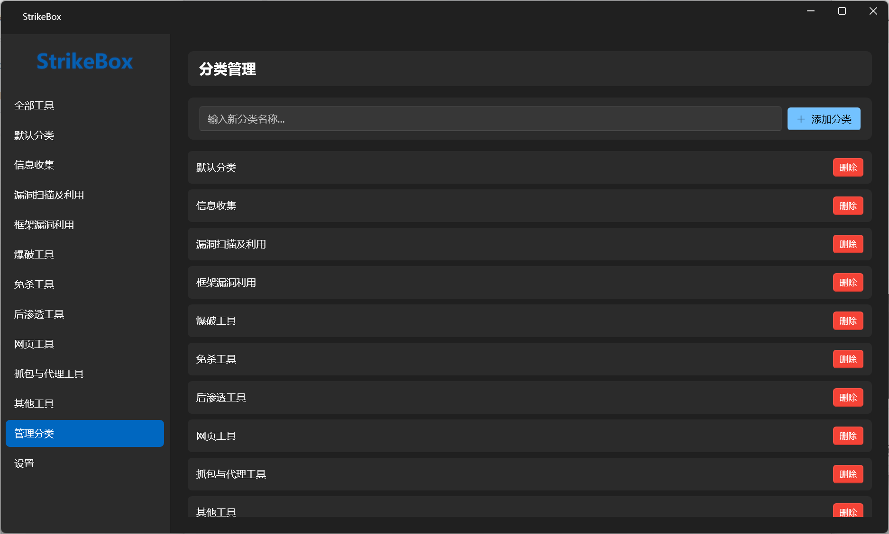
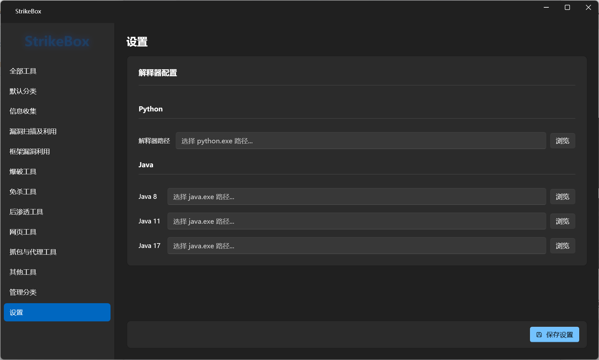

# StrikeBox - 工具箱

一站式安全工具启动面板，统一管理各类安全测试工具，分类浏览、快速搜索、一键启动。

## 功能

- **工具管理** — 添加/编辑/删除工具，自定义分类，支持搜索筛选
- **多类型启动** — GUI EXE、GUI Java、终端 EXE、终端 Python、终端 Java、网页链接
- **解释器配置** — 集中管理 Python、Java 8/11/17 运行环境路径
- **深色/浅色主题** — 一键切换，Mica 背景材质
- **数据持久化** — JSON 配置文件，自动保存在 AppData

## 截图

| | |
|------|------|
|  |  |
|  |  |

## 技术栈

| 组件 | 说明 |
|------|------|
| .NET 8 | WPF 桌面应用 |
| [WPF-UI](https://github.com/lepoco/wpfui) | Fluent Design 现代化 UI |
| [CommunityToolkit.Mvvm](https://github.com/CommunityToolkit/dotnet) | MVVM 架构框架 |
| Microsoft.Extensions.DI | 依赖注入 |

## 项目结构

```
StrikeBox/
├── Models/          # 数据模型
├── ViewModels/      # 视图模型（MVVM）
├── Views/           # 视图 + 对话框
├── Services/        # 配置、日志、导航、工具执行
│   └── Runners/     # 六种工具启动器
├── Converters/      # WPF 值转换器
├── Styles/          # 全局样式 & 卡片样式
└── Assets/          # 资源文件
```

## 构建

```bash
dotnet build
dotnet run --project StrikeBox/StrikeBox.csproj
```

或使用 Visual Studio 2022+ 打开 `StrikeBox.sln`。

## 配置文件

所有工具数据和设置保存在：

```
%AppData%\StrikeBox\config.json
```

如需重置为默认配置，删除 `StrikeBox` 文件夹后重新启动应用即可。

## 免责声明

本项目仅供**学习交流**使用，不得用于任何非法用途。使用者应遵守所在地法律法规，任何因滥用本工具造成的后果由使用者自行承担，与作者无关。

---

# English

StrikeBox is a launcher panel for organizing security tools — browse by category, quick search, one-click launch.

## Features

- **Tool Management** — Add / edit / delete tools, custom categories, search & filter
- **Multi-Type Launch** — GUI EXE, GUI Java, Terminal EXE, Terminal Python, Terminal Java, Web link
- **Interpreter Config** — Centralized Python, Java 8/11/17 path settings
- **Dark / Light Theme** — One-click toggle with Mica backdrop
- **Data Persistence** — JSON config auto-saved in AppData

## Configuration

All tool data and settings are stored in:

```
%AppData%\StrikeBox\config.json
```

Delete the `StrikeBox` folder and restart the app to reset to defaults.

## Tech Stack

| Component | Description |
|-----------|-------------|
| .NET 8 | WPF Desktop App |
| [WPF-UI](https://github.com/lepoco/wpfui) | Fluent Design Modern UI |
| [CommunityToolkit.Mvvm](https://github.com/CommunityToolkit/dotnet) | MVVM Framework |
| Microsoft.Extensions.DI | Dependency Injection |

## Build

```bash
dotnet build
dotnet run --project StrikeBox/StrikeBox.csproj
```

Or open `StrikeBox.sln` with Visual Studio 2022+.

## Disclaimer

This project is for **educational purposes only**. Users must comply with local laws and regulations. The author is not responsible for any misuse.
